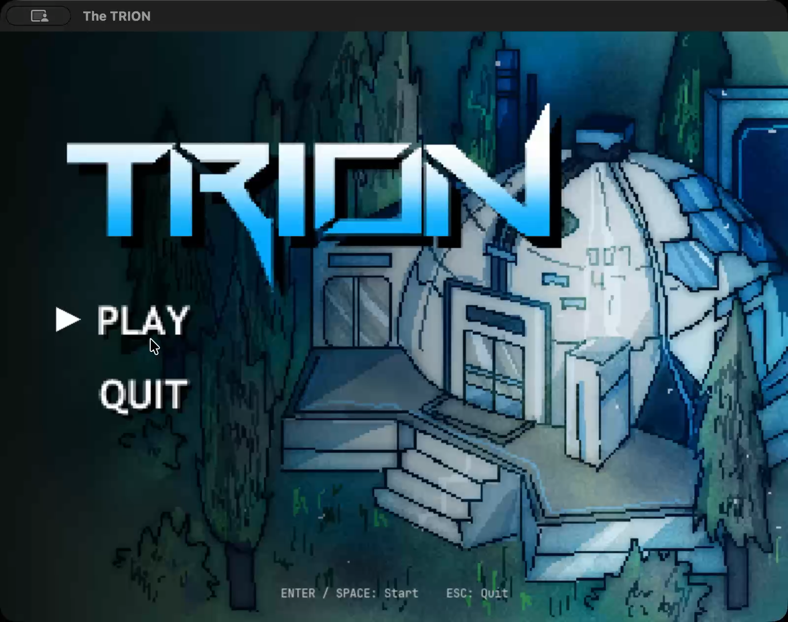
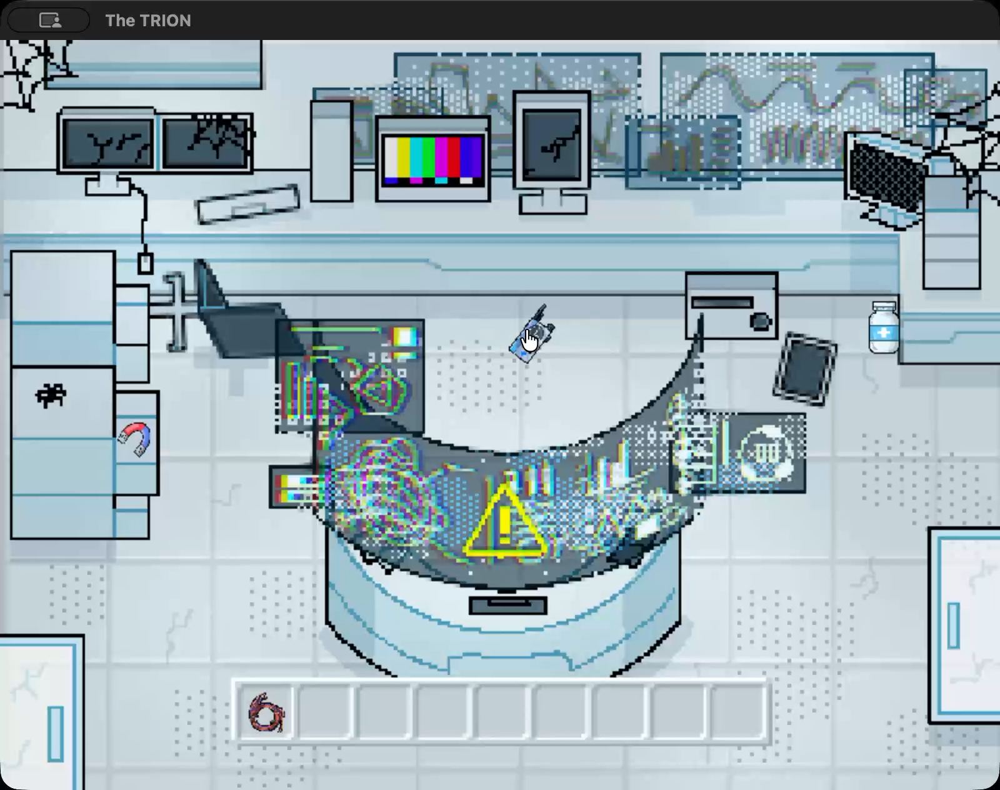
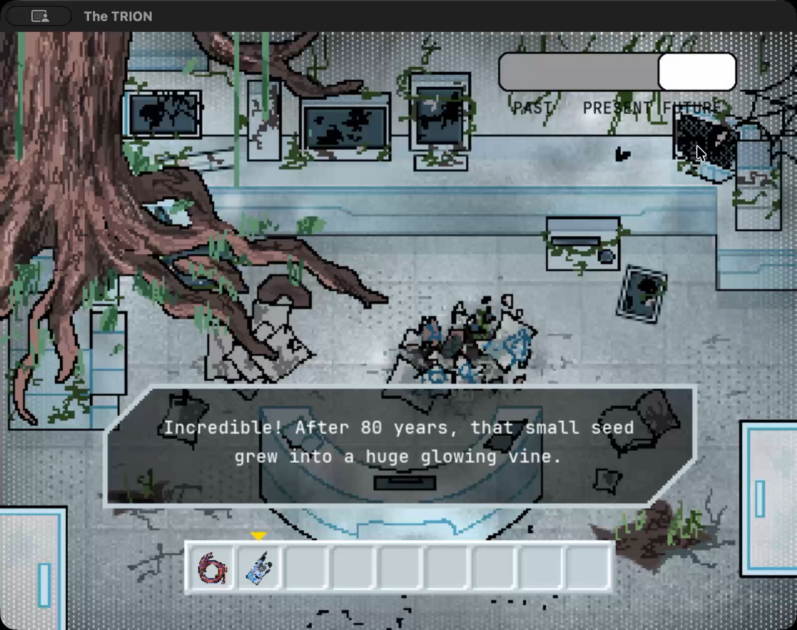
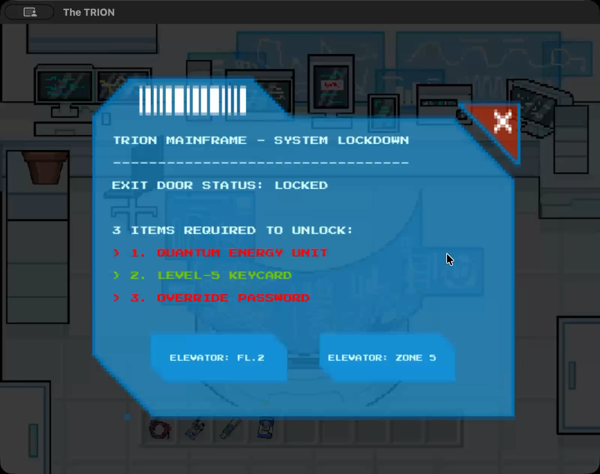
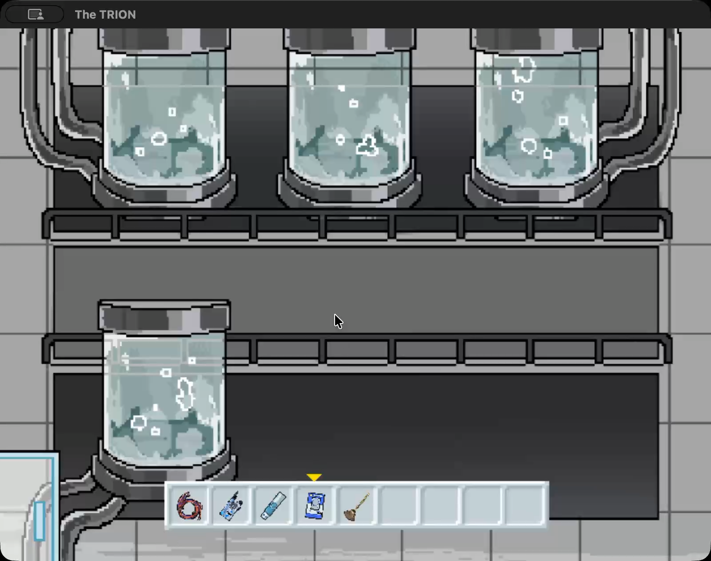
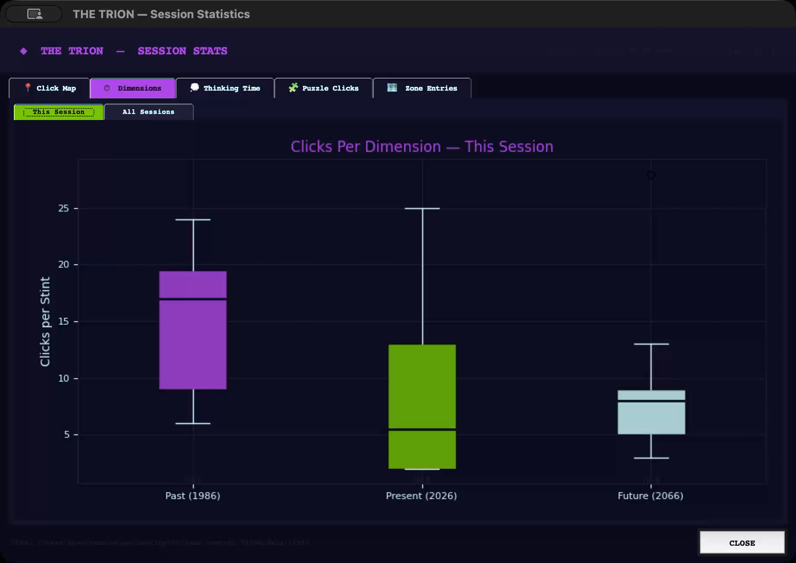

# Project Description

## 1. Project Overview

- **Project Name:** The TRION

- **Brief Description:**  
  The TRION is a 2D point-and-click adventure puzzle game built with Python and Pygame. Players wake up inside a ruined research facility with no memory of who they are. To escape and uncover the truth, they must navigate six zones of the facility. Each zone have three time periods (Past: 1986, Present: 2026, and Future: 2066). Collecting items, solving environmental puzzles, and piecing together a hidden narrative.

  The core mechanic revolve around a device called the **Time Tuner**. Once obtained, the player can freely shift between past, present, and future views of any zone. Many puzzles require the player to bring objects from one era into another, creating a cause and effect chain across time.

- **Problem Statement:**  
  Traditional puzzle games offer a flat, single timeline world. The TRION explores how time travel mechanics can deepen puzzle design. Forcing players to think not just about what to do, but when to do it. The challenge is to create logical, satisfying puzzles where actions in one time period have visible consequences in another.

- **Target Users:**  
  Players who enjoy narrative driven puzzle and adventure games.

- **Key Features:**  
  - Three era time travel (Past / Present / Future) affecting every zone's visuals and interactable objects  
  - Six interconnected puzzle chains requiring items and actions across different time periods  
  - Inventory system with up to 9 collected items  
  - Dialogue system that reveals the story and provides hints

- **Screenshots:**

  | Main Menu | Gameplay |
  |---|---|
  |  |  |

  | Time Travel Mechanic | Computer UI |
  |---|---|
  |  |  |

  | Inventory & Items | Statistics Dashboard |
  |---|---|
  |  |  |

- **Proposal:** [Original Proposal.pdf](Original%20Proposal.pdf)

- **Presentation:** [YouTube — The TRION Presentation](https://youtu.be/1Om7XwE3PLY?si=6x78gT9HaNPEI5ER)

---

## 2. Concept

### 2.1 Background

- **Why this project exists:** The TRION was created as a semester project for a Computer Programming 2 course at Kasetsart University. The goal was to design a OOP game and implementing real game logic, a data collection, and a visualization system.
- **What inspired the project — Project Review:** *Cube Escape* inspired the core concept. Players trapped in a location must travel between different time periods to solve puzzles. In *Cube Escape*, players interact with specific in-world objects to trigger time changes. The TRION improves on this by letting players shift time freely at any moment using the Time Slider , which is deeply tied to the game lore. Additionally, The TRION makes time changes immediately consequential. Actions like planting a seed in the past instantly update the future environment, creating a real cause-and-effect chain rather than isolated per-room puzzles.
- **Importance of solving this problem:** Designing puzzles across three timelines requires careful state management and encapsulation of per-item and per-scene state, inheritance concepts through consistent item behavior, and separation of concerns between the game loop, UI, and data layers.

### 2.2 Objectives

- Build a fully playable point-and-click puzzle game using OOP design.  
- Implement a time-travel mechanic where each zone has three visually and functionally distinct states.  
- Create a narrative payoff. The player learns their identity and the facility's history through environmental storytelling.  
- Automatically collect and visualize player behavioral data after each session to support game-design analysis.

---

## 3. UML Class Diagram

The class diagram covers the following:

- **Classes:** `Game`, `Scene`, `Item`, `MenuScene`, `StatsTracker`, `TimeSlider`, `Inventory`, `MainComUI`, `DialogueUI`  
- **Key Attributes:** game flags, zone/time state, item properties (name, rect, mask, collectable)  
- **Key Methods:** `run()`, `handle_events()`, `draw()`, `on_click()`, `record_click()`, `finalise()`  
- **Relationships:** `Game` aggregates `Scene`, `Inventory`, `StatsTracker`, and UI classes; `Scene` contains a list of `Item` objects

**Diagram:** [UML Class Diagram.pdf](UML%20Class%20Diagram.pdf)

---

## 4. Object-Oriented Programming Implementation

- **`Game`** : Central game controller. Manages the main loop, all game state flags, the current zone and time period.
- **`Scene`** : Represents a single zone. Loads three background images (past/present/future), holds a list of `Item` objects, and handles per-frame drawing, hover detection, and click dispatching for its zone.  
- **`Item`** : Represents an interactable object in the game. Stores position, sprite, and time period. Contains `on_click()` with all item-specific puzzle logic.  
- **`MenuScene`** : Self-contained main menu with invisible hitbox buttons, a hover indicator, keyboard shortcuts.
- **`StatsTracker`** : Records player behavior (click coordinates, time-dimension stints, idle gaps, puzzle-stage clicks, zone entries), then flush them to CSV files at session end.
- **`TimeSlider`** : Renders and handles the top-right UI widget that lets the player switch time periods when holding the Time Tuner.  
- **`Inventory`** : Renders the bottom inventory bar, manages adding/removing/selecting items, and draws selected-item highlights.  
- **`MainComUI`** : Overlay UI for the zone 1 supercomputer terminal, with context options depending on game state.  
- **`DialogueUI`** : Renders story dialogue panels with a click-to-continue system.

---

## 5. Statistical Data

### 5.1 Data Recording Method

Data is collected during every game session via the `StatsTracker` class. On every left mouse click, the tracker records the event into lists . When the game ends, `StatsTracker.finalise()` appends all collected rows to five CSV files. Each session is identified by a unique `session_id` (timestamp + random hex). After the game window closes, a separate process launches a Tkinter dashboard that reads both the live in-memory data and the full CSV history to display combined analytics.

### 5.2 Data Features

| Feature | Why collect it | Graph type | X-axis | Y-axis |
|---|---|---|---|---|
| **Click Coordinates** | Shows which screen areas players explore most — reveals if puzzle items are well distributed or ignored | 2 bar graphs (side by side) | Screen X coordinate / Screen Y coordinate | Click count |
| **Clicks Per Dimension** | If players click 50× in Past but only 2× in Future, the Future dimension may lack interactive content — `stint_id` increments on every time switch | Boxplot | Dimension (Past / Present / Future) | Clicks per stint |
| **Thinking Time** | Identifies difficulty spikes — a long idle gap before a click means the player was stuck on a puzzle | Line graph | Thinking event # (chronological) | Idle duration (seconds) |
| **Clicks Between Puzzles** | Measures how many interactions each puzzle requires — more clicks = harder puzzle | Table of statistical values (Min / Max / Mean / Median / Std Dev per stage) | Puzzle stage | Click count |
| **Zone Entrance Count** | Low entry count for a zone suggests its puzzles are poorly distributed or players avoid it | Bar graph | Zone name | Entrance count |

---

## 6. Changed Proposed Features (Optional)

- **Thinking Time definition:** The proposal originally logged a row every 2 seconds during inactivity (a background timer). This was changed. Per instructor feedback to log a single row only when an idle gap exceeding 3 seconds is detected between two consecutive clicks. This makes every row event-based and statistically meaningful.

---

## 7. External Sources

- **Pygame** — Game framework for rendering, input handling, and audio  
  - Author: Pygame Community  
  - License: LGPL  

- **Matplotlib** — Charts and graphs in the stats dashboard  
  - Author: Matplotlib Development Team  
  - License: PSF / BSD-compatible  

- **NumPy** — Array math for statistical calculations in the dashboard  
  - Author: NumPy Contributors  
  - License: BSD 3-Clause  

- **VT323 Font** — Pixel/retro monospace font used for in-game UI text  
  - Author: Peter Hull  
  - Source: Google Fonts  
  - License: SIL Open Font License 1.1  

- **JetBrains Mono Font** — Used for hint and label text  
  - Author: JetBrains  
  - Source: JetBrains / Google Fonts  
  - License: SIL Open Font License 1.1  

- **Background artwork, item sprites, and UI images** — Created specifically for this project
