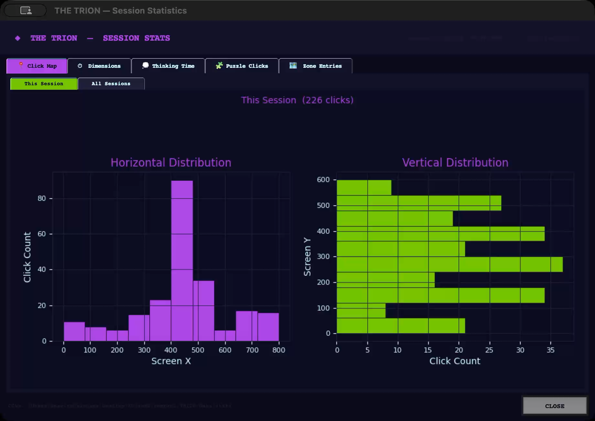
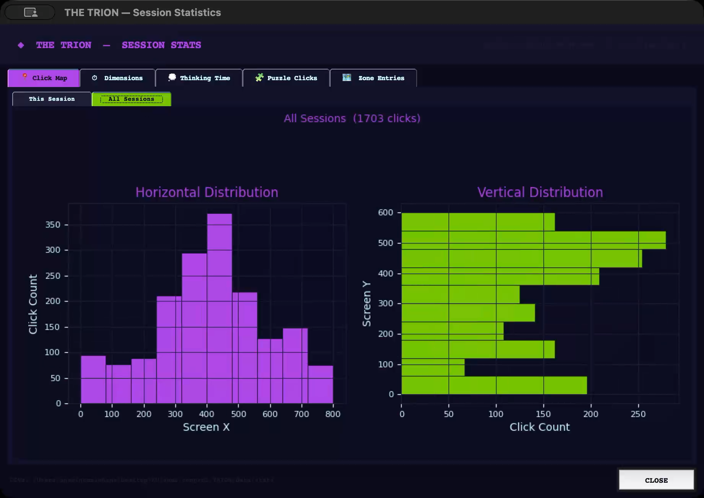
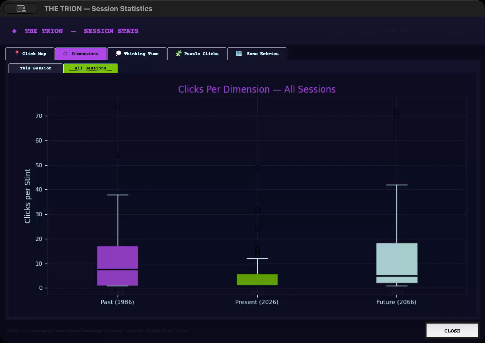
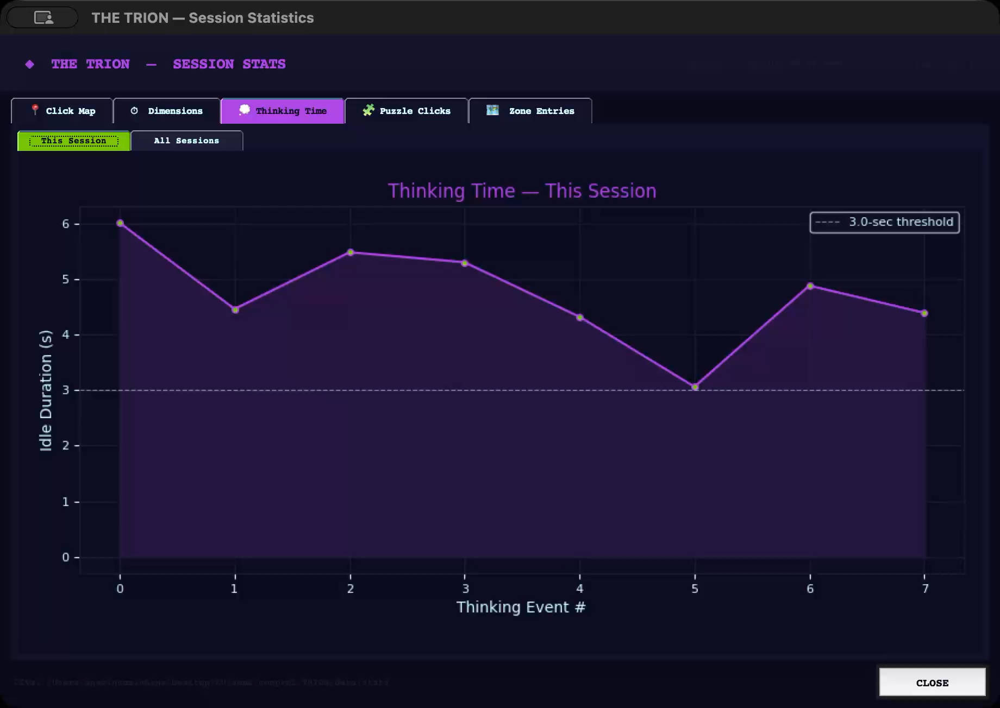
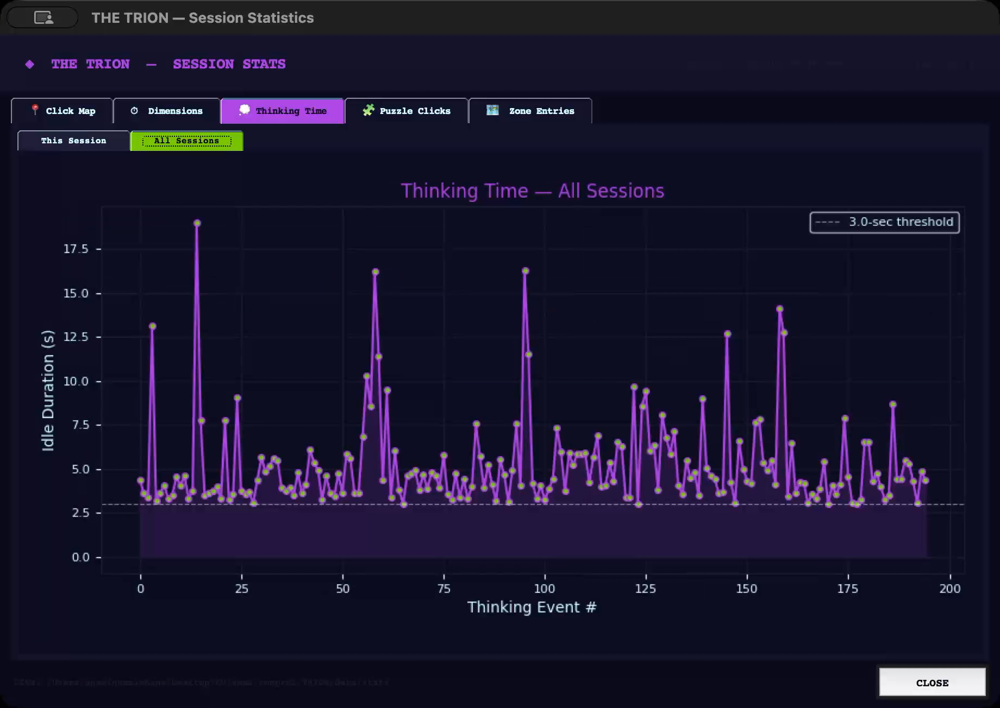
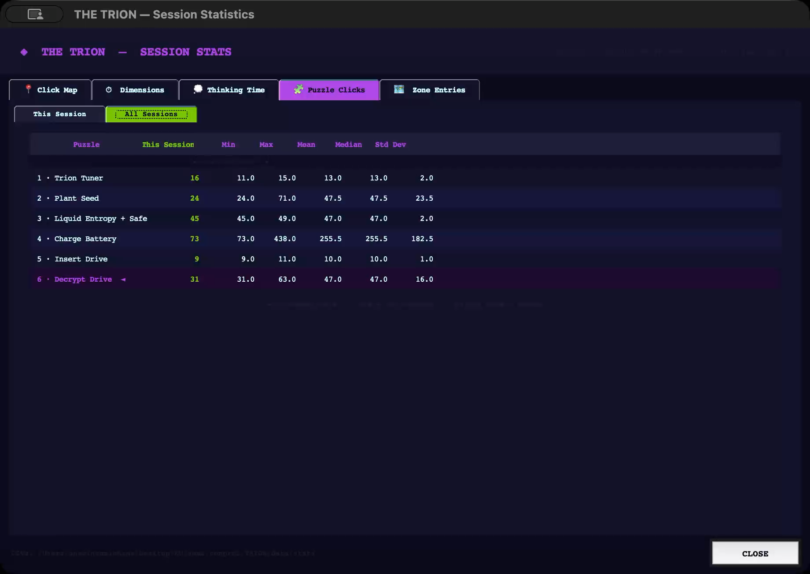
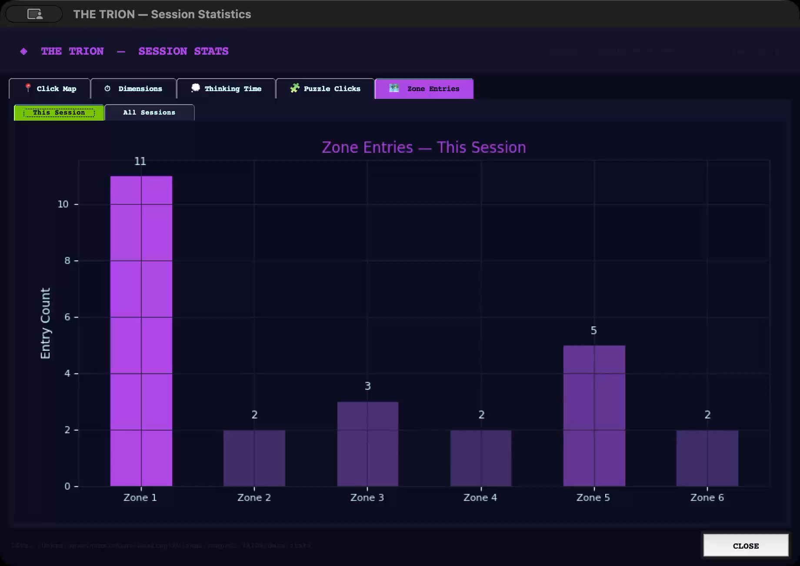
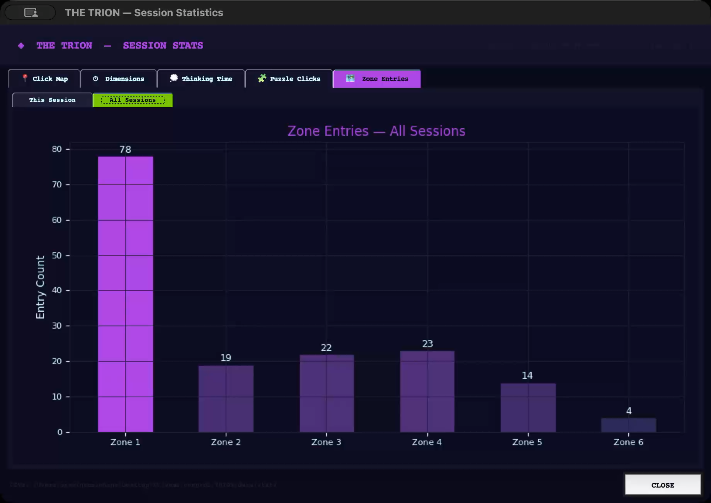

# Data Visualization

## Click Map (Bar Graphs)

### This Session

Two bar graphs show where the player clicked during the session. The left graph (purple) shows clicks by Screen X (horizontal), and the right graph (green) shows clicks by Screen Y (vertical). This helps see if players explored the whole screen or stayed in one area.

### All Sessions

The same bar graphs but using data from all recorded sessions. With more data, the pattern becomes clearer and shows where players generally tend to click across all playthroughs.

---

## Dimensions (Boxplot)

### This Session

A boxplot comparing how many clicks the player made in each time period (Past, Present, Future) per stint. A stint is a series of clicks in one time period before switching. Past has the highest median, meaning players spend more time there. Future has the lowest, meaning players visit it briefly.

### All Sessions

The same boxplot across all sessions. The pattern is consistent — Past gets the most clicks per stint, while Present and Future are shorter. This shows that the Past dimension has more content that keeps players engaged longer.

---

## Thinking Time (Line Graph)

### This Session

A line graph showing how long the player paused between clicks during the session. Each point is an idle gap longer than 3 seconds. The dashed line marks the 3-second threshold. Higher spikes mean the player was stuck or thinking. The first spike at ~6 seconds suggests the player needed time to figure out what to do at the start.

### All Sessions

The same graph across all sessions, showing over 200 thinking events. Spikes are spread throughout the game, meaning players get stuck at different points rather than only at the beginning or end. Some events reach 15+ seconds, pointing to harder puzzle moments.

---

## Puzzle Clicks (Statistical Table)

### All Sessions

A table showing how many clicks each player used per puzzle, with Min, Max, Mean, Median, and Std Dev across all sessions. **Charge Battery** has the highest mean and Std Dev, making it the hardest and most inconsistent puzzle. **Insert Drive** has the lowest mean and Std Dev, making it the easiest and clearest puzzle to solve.

---

## Zone Entries (Bar Graph)

### This Session

A bar graph showing how many times the player entered each zone during the session. Zone 1 has the most entries since it is the main hub zone that connects to all others. Zone 6 has the fewest since players only visit it near the end of the game.

### All Sessions

The same bar graph across all sessions. Zone 1 still leads. Zone 3 and Zone 4 also have higher counts because their puzzles require players to travel back and forth multiple times. Zone 6 has the fewest visits, as expected for the final puzzle area.
